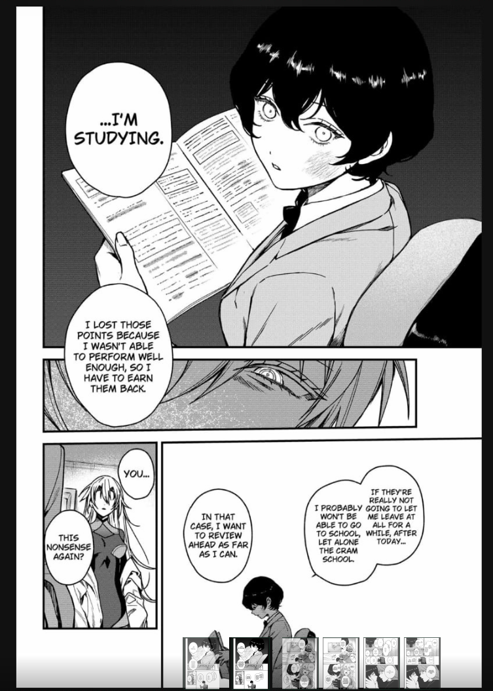
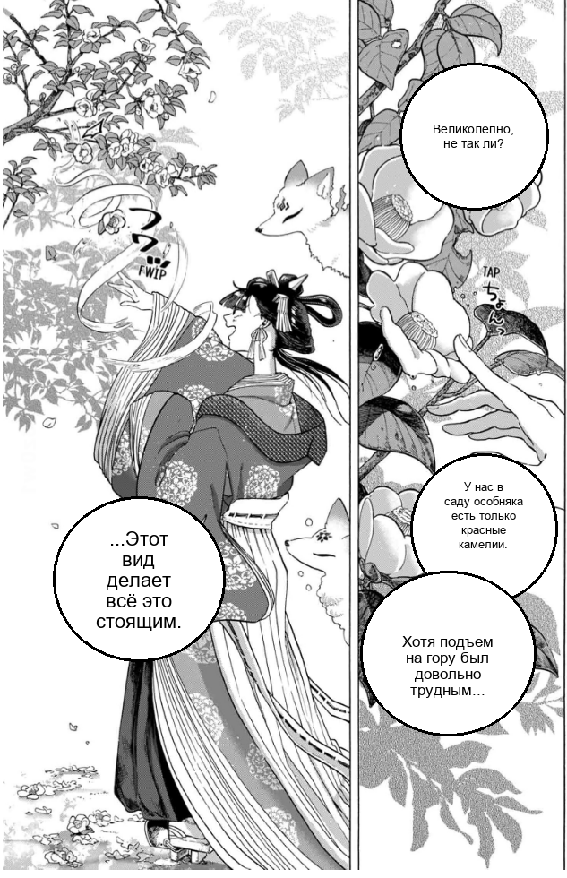

# ScreenTranslate

Десктопное приложение для перевода манги и комиксов прямо с экрана.
Пользователь выделяет область на экране, приложение находит облачки с текстом,
распознаёт английский текст и показывает русский перевод поверх изображения
в виде прозрачного оверлея.

Это pet-проект, который активно развивается.

**Платформа:** Windows (поддержка мультимониторности, DPI Awareness, глобальные горячие клавиши).

## Пример перевода

<div align="center">
  
  
</div>

*Слева: исходный фрагмент с английским текстом. Справа: тот же фрагмент после распознавания и перевода поверх изображения.*

## Возможности

- Захват произвольной области экрана (в том числе второго монитора).
- Детекция облачков (YOLOv8).
- OCR (PaddleOCR с обработкой слипшихся пузырей и морфологической предобработкой).
- Перевод и автоматическая правка ошибок OCR через OpenAI-совместимый API.
- Два режима рендеринга: **Манга** (круглые пузыри) и **Манхва** (смешанные формы + outside text).
- Настраиваемые горячие клавиши (в UI или через `.env`).
- MD5-кэш переводов для экономии токенов.
- Прозрачный оверлей; повторное нажатие клавиши скрывает результат.

## Архитектура

Пайплайн обработки (в отдельном потоке, чтобы не блокировать UI):

1. `mss` захватывает скриншот выделенной области (поддержка нескольких мониторов).
2. YOLOv8 детектирует bounding boxes облачков.
3. Для каждого облачка применяется морфологическая предобработка
   (adaptive threshold, connected components) перед OCR.
4. PaddleOCR распознаёт текст; результаты дедуплицируются по IoU.
5. LLM через OpenAI API делает перевод пачкой (с сепаратором `|||SEP|||`),
   одновременно исправляя типичные OCR-ошибки (слитное написание, опечатки).
6. Адаптивный рендеринг текста: форма пузыря (круг/прямоугольник) определяется
   через анализ контуров и aspect ratio, шрифт подбирается под доступное место.
7. Результат выводится через Tkinter-окно с прозрачным фоном поверх экрана.

## Горячие клавиши

| Клавиша | Действие |
|---------|----------|
| **F2** | Выделить область на экране |
| **Q** / **Й** | Запустить перевод / скрыть оверлей |
| **Esc** | Отмена выделения |

Клавиша перевода меняется в настройках приложения или через переменную
`HOTKEY_TRANSLATE` в `.env`. Выделение области зафиксировано на F2.

## API провайдеры

Приложение работает с OpenAI-совместимым API. В интерфейсе уже заранее настроены основные провайдеры:

| Провайдер | Назначение |
|-----------|-----------|
| **Groq** | Быстро и экономично, подойдёт для серийного перевода |
| **OpenAI** | Стабильный и широко поддерживаемый API |
| **Ollama** | Полностью локальный инференс без внешних сервисов |
| **LocalAI** | Локальный сервер с OpenAI-совместимым интерфейсом |
| **Custom** | Любой другой совместимый эндпоинт |

## Установка

### 1. Требования

- **Python 3.10 - 3.11** (PaddleOCR имеет проблемы совместимости на 3.12+).
- Windows 10/11.

### 2. Зависимости

```bash
git clone https://github.com/Merk1l/ScreenTranslate.git
cd ScreenTranslate
python -m venv .venv
.venv\Scripts\activate
pip install -r requirements.txt
```

> **Замечание по PaddleOCR.** Установка через обычный `pip install paddlepaddle`
> может не сработать из-за конфликтов версий CUDA/Python. При проблемах
> следуйте [официальной инструкции PaddlePaddle](https://www.paddlepaddle.org.cn/install/quick),
> затем установите остальные пакеты из `requirements.txt`.

### 3. Модель детектора (YOLO)

Скачайте веса модели и положите в папку `models/`:

```
models/comic-speech-bubble-detector.pt
```

Источники весов:
- [ogkalu/comic-speech-bubble-detector-yolov8m (Hugging Face)](https://huggingface.co/ogkalu/comic-speech-bubble-detector-yolov8m) -
  обучена на ~8k страницах манги, вебтунов и комиксов.
- Либо обучите собственную модель на датасетах с Roboflow Universe.

Без файла приложение запустится, но детекция облачков будет отключена.

### 4. Конфигурация

```bash
copy .env.example .env
```

Отредактируйте `.env`, указав как минимум `API_KEY`. Остальные параметры
можно задать позже через графический интерфейс.

### 5. Запуск

```bash
python main.py
```

## Структура проекта

```
ScreenTranslate/
  main.py              # всё приложение находится в одном модуле
  requirements.txt     # закреплённые версии зависимостей
  .env.example         # шаблон конфигурации
  .gitignore
  LICENSE              # MIT
  models/              # здесь хранятся веса YOLO (не в git)
  .cache/              # MD5-кэш переводов (не в git)
```

## Известные проблемы

- **Чёрный скриншот в браузере.** При захвате окна Chrome/Edge вместо
  контента получается чёрный прямоугольник. Причина: браузер использует
  аппаратное ускорение (DirectX) и рисует вне системного фреймбуфера.
  **Решение:** отключите «Hardware Acceleration» в настройках браузера.
- **Стилизованные шрифты.** PaddleOCR может ошибаться на декоративных
  шрифтах и звуковых эффектах (SFX). Системный промпт LLM настроен на
  автоисправление OCR-ошибок, но сложные случаи требуют ручной правки.
- **Интернет.** Нужен для обращения к API (кроме локальных моделей через Ollama).

## Лицензия

MIT - см. [LICENSE](LICENSE).
Используйте приложение только для контента, на который у вас есть права.
